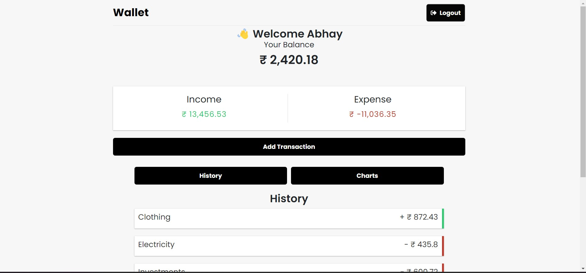
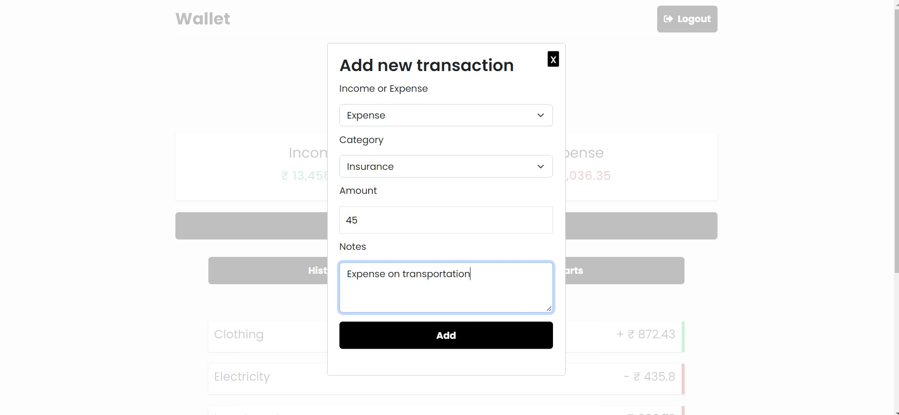
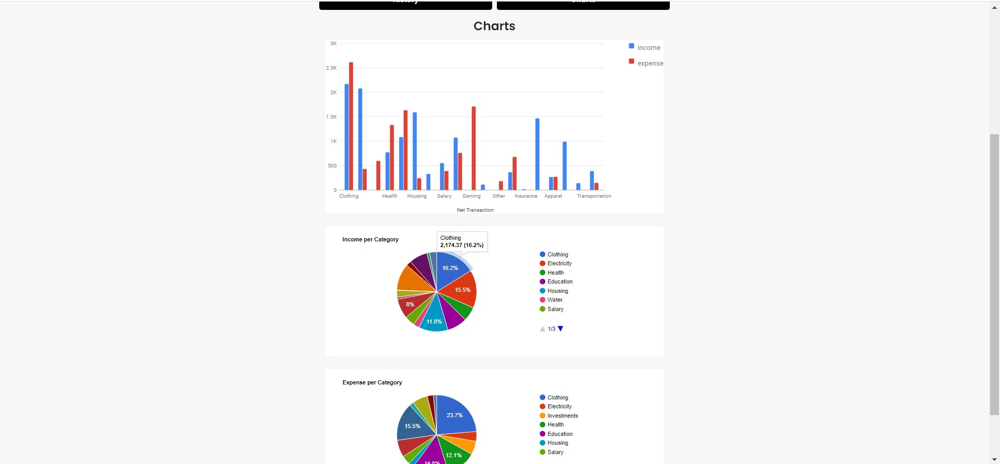
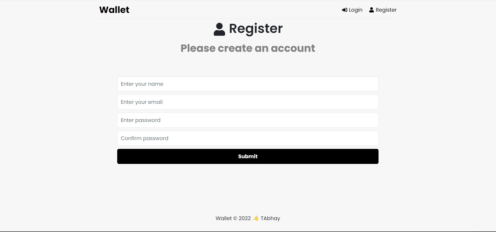
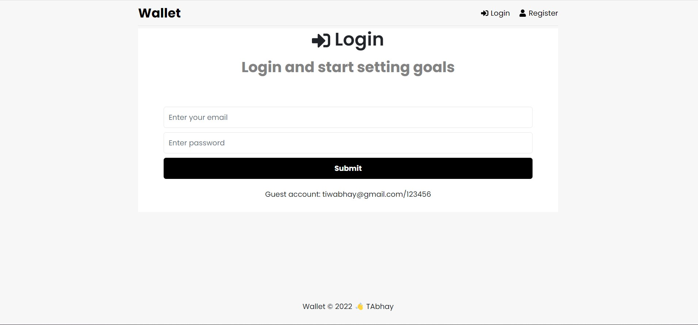
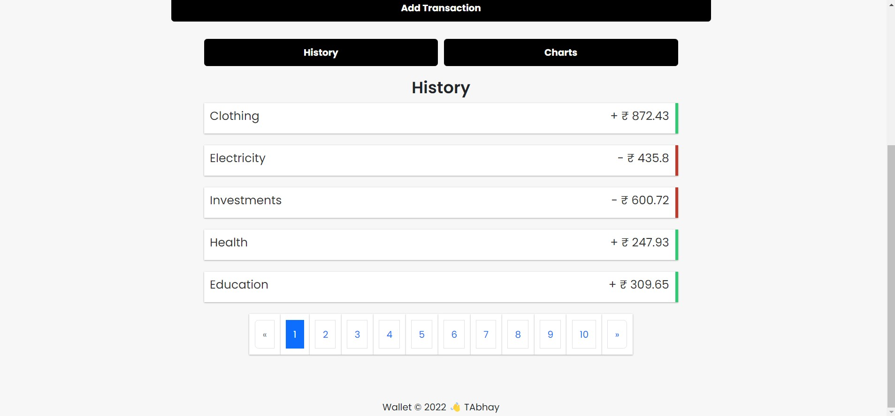

# Wallet

A user-friendly web application which can track the daily income & expense of the user.
Get started with your expense and income trackig in few clicks.

Register / Login / Logout, Browse / Create / Edit / Delete, GET / POST / PUT / DELETE.
Visualize your expense and income using charts.

| Visit - : https://wallet-v0tz.onrender.com/ |
| Cyclic -: https://nice-pink-tick-kit.cyclic.app/ |

#Demo email and password

| Role | Email     | Password                       |
| :-------- | :------- | :-------------------------------- |
| User     |  tiwari@gmail.com| 123456  |

## Clone the repo


Install the dependencies and devDependencies and start the server.
```sh
cd Wallet
npm i all
npm start  
cd frontend

npm start
```








## Still Working
